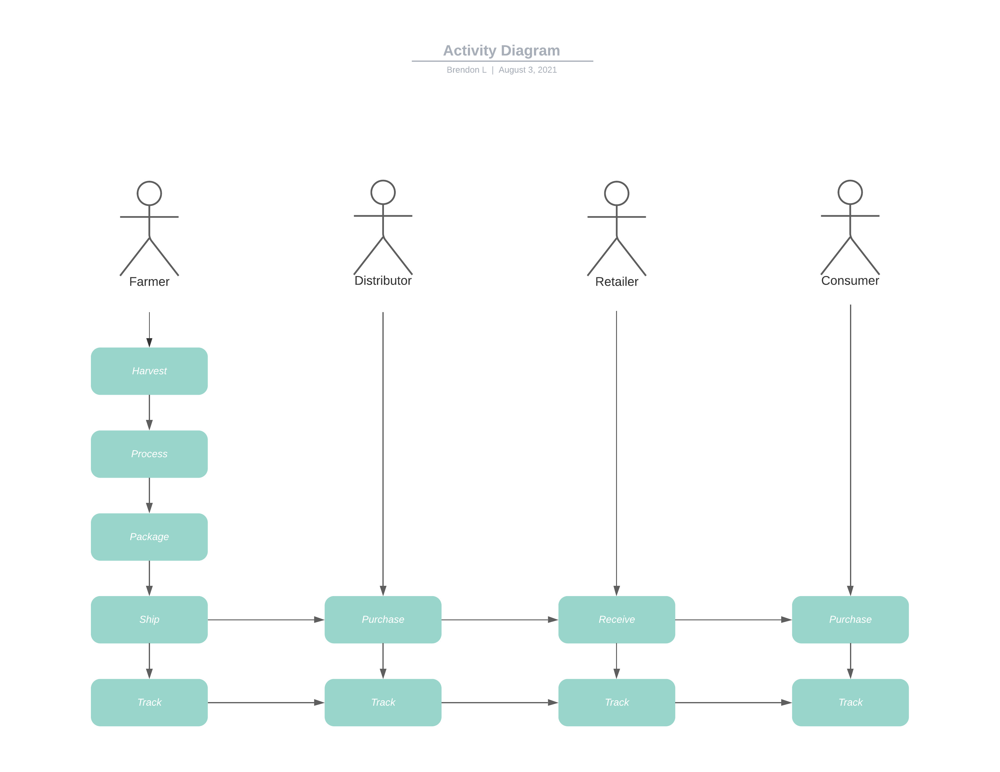
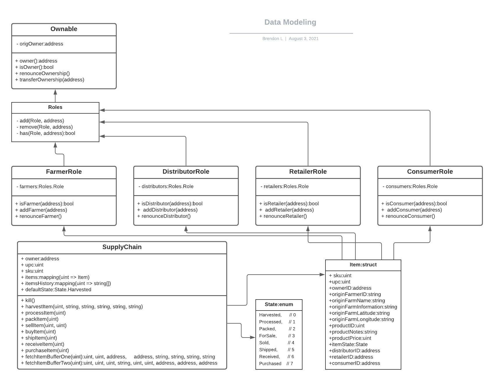
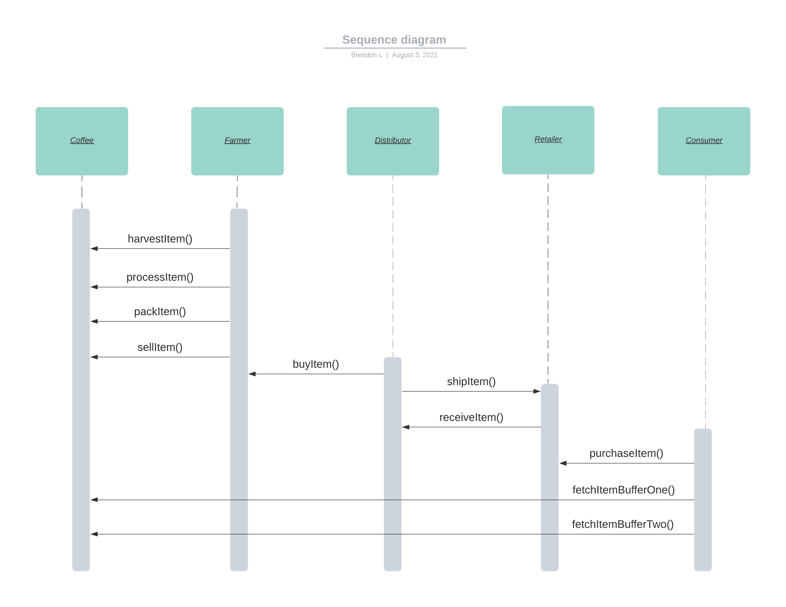
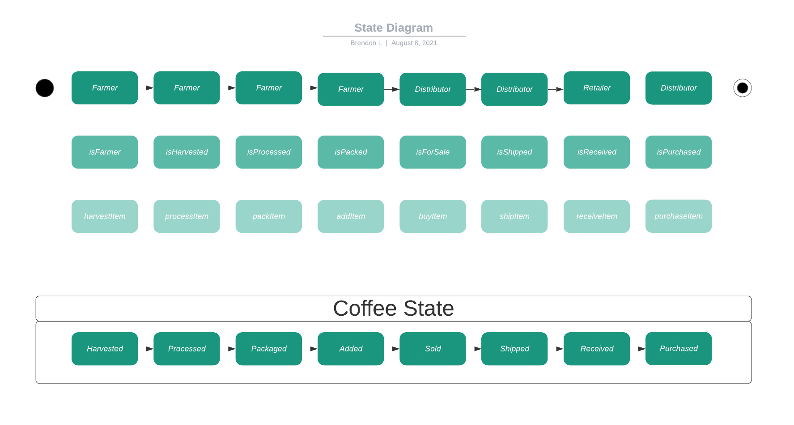

# Supply chain & data auditing
Udacity Blockchain Developer Project 3: Smart supply chain management using smart contracts.

## UML Diagrams

## Contract Deployment
Not deployed yet.

## Additional Libraries
None